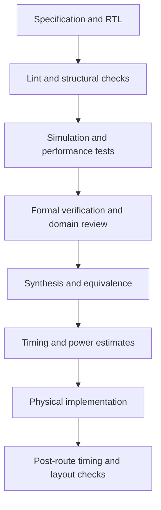

<div align="center">

# Verilog RTL Design

### Describe the circuit. Challenge the logic. Measure the hardware.

An open-source digital design workspace for RTL development, verification, synthesis, and physical implementation.

**Verilog · SystemVerilog · Python · Tcl**

[](LICENSE)
[](#open-source-toolchain)
[](#about)

</div>

---

## About

Good RTL should survive more than compilation.

It should behave correctly under stress, cross clock boundaries safely, synthesize into sensible hardware, and meet constraints that reflect how the circuit will actually operate.

This repository is a growing collection of digital designs and their supporting engineering work: specifications, testbenches, assertions, constraints, automation, reports, and implementation notes.

The intended workflow uses **open-source tools throughout**. Each project documents which stages have been implemented and which checks have actually passed.

## Repository Scope

The design collection is intended to cover:

| Category | Topics |
| :--- | :--- |
| Combinational logic | Multiplexers, encoders, decoders, comparators, arithmetic circuits |
| Sequential logic | Registers, counters, shift registers, clock enables |
| Control logic | Finite state machines, arbiters, handshake controllers |
| Datapaths | ALUs, pipelining, arithmetic units |
| Storage | Register files, RAM interfaces, synchronous FIFOs |
| Multiple clock domains | Synchronizers, pulse transfers, asynchronous FIFOs |
| Interfaces | UART, SPI, I²C, APB, and AXI-Lite |
| Integration | Connecting control, storage, datapaths, and interfaces |

These categories describe the roadmap. Individual project directories identify available implementations.

## Engineering Workflow



Verification feeds back into design throughout the flow. A later stage does not replace checks performed earlier.

## Open-Source Toolchain

| Engineering stage | Open-source tools | Purpose |
| :--- | :--- | :--- |
| RTL style and formatting | [Verible](https://github.com/chipsalliance/verible) | Style linting, formatting, and source consistency |
| RTL lint | [Verilator](https://github.com/verilator/verilator) | Width, connectivity, assignment, and other RTL diagnostics |
| Structural checks | [Yosys](https://github.com/YosysHQ/yosys) | Driver conflicts, undriven signals, logic-loop detection, and synthesis diagnostics |
| Event-driven simulation | [Icarus Verilog](https://github.com/steveicarus/iverilog) | Verilog simulation and supported SystemVerilog constructs |
| Compiled simulation | [Verilator](https://github.com/verilator/verilator) | Compiled RTL models for simulation and regression |
| Testbench automation | [cocotb](https://github.com/cocotb/cocotb), [pytest](https://github.com/pytest-dev/pytest) | Python stimulus, reference models, scoreboards, and test orchestration |
| Waveform debugging | [GTKWave](https://github.com/gtkwave/gtkwave) | VCD and FST waveform inspection |
| Coverage | Verilator, custom Python coverage models | Supported RTL coverage and explicitly defined functional coverage |
| Formal verification | [SymbiYosys](https://github.com/YosysHQ/sby), Yosys, supported open-source solvers | Safety properties, bounded checks, proofs, and cover traces |
| CDC and RDC review | Yosys-assisted inspection, SymbiYosys, custom analysis scripts | Structural review and selected protocol/reset properties |
| Logic synthesis | Yosys and ABC | Optimization, technology mapping, and netlist generation |
| Logical equivalence | [EQY](https://github.com/YosysHQ/eqy), Yosys equivalence passes | Comparing supported reference and modified implementations |
| Static timing analysis | [OpenSTA](https://github.com/The-OpenROAD-Project/OpenSTA) | Constraint-driven setup, hold, and timing-path analysis |
| Performance testing | cocotb, Verilator, Python | Latency, throughput, stalls, occupancy, and workload measurements |
| Power estimation | OpenSTA, simulation activity | Library-based estimates using supported activity annotation |
| Floorplanning and placement | [OpenROAD](https://github.com/The-OpenROAD-Project/OpenROAD) | Physical implementation |
| Clock tree synthesis | OpenROAD | Clock-tree construction and analysis |
| Routing and parasitic extraction | OpenROAD and OpenRCX | Routing and supported parasitic extraction |
| Scan-chain exploration | OpenROAD DFT | Supported scan-cell replacement and chain construction |
| Layout viewing and verification | [KLayout](https://github.com/KLayout/klayout) | Layout inspection, DRC, and LVS with suitable rule decks |
| Flow orchestration | [OpenROAD Flow Scripts](https://github.com/The-OpenROAD-Project/OpenROAD-flow-scripts) | An integrated open-source RTL-to-GDS flow |
| Build and reporting | GNU Make, Python, Tcl | Repeatable commands, report parsing, and result summaries |

**Tool boundaries matter:** Verible is primarily a style linter. Yosys structural checks are not a complete CDC analyzer. Formal properties prove only the behavior expressed under their assumptions.

## 01 · RTL Development

Each design begins with a specification covering:

- Module purpose and operating modes.
- Port definitions and signal widths.
- Clock and reset behavior.
- Transactions and timing relationships.
- Boundary conditions and error handling.
- Expected latency and throughput.
- Parameters and supported configurations.

RTL should make the intended hardware clear, with deliberate treatment of signed arithmetic, reset values, inferred storage, and combinational defaults.

## 02 · Lint & Structural Analysis

**Tools:** Verible, Verilator, Yosys.

The planned checks include:

- Width mismatches and unintended truncation.
- Signed and unsigned expression issues.
- Incomplete combinational assignments.
- Unexpected latch inference.
- Conflicting drivers and undriven signals.
- Unused declarations and disconnected logic.
- Combinational loops.
- Suspicious sequential and combinational coding patterns.

Warnings must be reviewed. A waiver should identify the affected rule, the reason it is acceptable, and the configurations to which it applies.

**Expected outputs:** lint logs, structural-check logs, and reviewed waivers.

## 03 · Functional Simulation

**Tools:** Icarus Verilog, Verilator, cocotb, pytest, GTKWave.

Verification combines directed tests with reproducible randomized stimulus where useful.

Test scenarios include:

- Reset and initialization.
- Normal operation.
- Boundary values.
- Back-to-back transactions.
- Backpressure and stalled transfers.
- Overflow and underflow behavior.
- Invalid inputs where behavior is specified.
- Parameter variations.
- Reset during active operation.

Scoreboards compare observed results against an independent expected model.

**Expected outputs:** test results, failing seeds, simulator logs, and selected waveforms.

## 04 · Coverage

**Tools:** Verilator and project-specific Python coverage models.

Coverage is tracked according to the capabilities of the selected simulator and testbench.

Possible coverage targets include:

- RTL execution and toggle coverage where supported.
- Operating modes.
- Input boundaries.
- FSM transitions.
- Transaction types.
- FIFO occupancy ranges.
- Backpressure scenarios.
- Error and recovery paths.
- Parameter combinations.

A coverage percentage must identify its source and scope. Code coverage does not establish that all functional requirements were tested.

## 05 · Assertions & Formal Verification

**Tools:** SymbiYosys, Yosys, supported open-source solver backends.

Properties may check:

- Mutual exclusion.
- FIFO overflow and underflow prevention.
- Data ordering and preservation.
- Counter bounds.
- Legal state transitions.
- Output stability during stalls.
- Handshake behavior.
- Reset recovery.
- Progress under explicitly stated environment assumptions.

Every formal result should record:

- The property being checked.
- Environment assumptions.
- Parameter configuration.
- Proof or bounded-check mode.
- Depth or bound where relevant.
- Tool versions and result.

An unsuccessful proof, timeout, or inconclusive result is reported separately from a proven property.

## 06 · Clock & Reset Domain Review

**Approach:** documented domain intent, structural inspection, targeted simulation, and formal properties.

### Clock Domain Crossing

Review focuses on:

- Source and destination clock domains.
- Single-bit synchronizer structures.
- Pulse-transfer mechanisms.
- Handshake-based crossings.
- Multi-bit data coherence.
- Gray-coded pointer transfers.
- Asynchronous FIFO behavior.
- Reconvergence after synchronization.
- Timing constraints for crossing structures.

### Reset Domain Crossing

Review focuses on:

- Reset polarity and domain ownership.
- Asynchronous assertion and controlled release.
- Reset synchronization where required.
- Transfers between independently reset domains.
- Reset during active transactions.
- State recovery after reset release.

**Scope:** this is a targeted CDC/RDC methodology, not comprehensive automated CDC/RDC signoff. Digital simulation does not reproduce analog metastability, and formal protocol checks do not establish physical synchronizer reliability.

**Expected outputs:** domain inventory, crossing review, assumptions, and targeted test/proof results.

## 07 · X-State & Initialization Checks

**Tools:** Icarus Verilog, targeted testbenches, and supported formal techniques.

Checks may exercise:

- Uninitialized registers.
- Unknown inputs.
- Reset omissions.
- Unknown values in control paths.
- Incomplete assignments.
- Startup behavior.

Four-state simulation is used where required and supported. Verilator's handling of unknown values differs from an event-driven four-state simulator; results must be interpreted accordingly.

## 08 · Logic Synthesis

**Tools:** Yosys and ABC.

Synthesis work includes:

- Elaboration and hierarchy checks.
- Process lowering and optimization.
- Memory handling.
- FSM optimization where applicable.
- Generic or library-based technology mapping.
- Netlist generation.
- Cell and resource statistics.

Mapped synthesis requires a suitable target library. Area comparisons should use the same library, constraints, and tool configuration.

**Expected outputs:** synthesis logs, mapped netlists, cell statistics, and implementation notes.

## 09 · Logical Equivalence

**Tools:** EQY and Yosys equivalence passes.

Equivalence checks may compare:

- Original and refactored RTL.
- Reference and optimized implementations.
- RTL and supported synthesized representations.

The comparison must account for reset assumptions, initialization, parameters, and any black-box components.

**Expected outputs:** comparison configuration, partition results, proof logs, and counterexamples where available.

## 10 · Static Timing Analysis

**Tool:** OpenSTA.

Timing analysis uses the applicable combination of:

- Mapped gate-level netlist.
- Liberty timing libraries.
- SDC constraints.
- Parasitic information when available.

Review includes:

- Clock definitions.
- Input and output delays.
- Clock uncertainty.
- Setup and hold paths.
- Transition and capacitance limits.
- Unconstrained paths.
- Generated clocks where applicable.
- Justified false-path and multicycle exceptions.

Pre-layout estimates and post-route results are reported separately. Timing exceptions require a design-based explanation.

**Expected outputs:** constraints, timing reports, violation summaries, and corner identification.

## 11 · Performance Testing

**Tools:** cocotb, Verilator, Python.

Performance tests measure the design under documented workloads.

| Metric | Measurement |
| :--- | :--- |
| Latency | Cycles between a defined request and completion event |
| Throughput | Completed transfers per cycle or simulated unit of time |
| Sustained bandwidth | Useful payload transferred during the measurement interval |
| Stall rate | Fraction of observed cycles spent stalled |
| Occupancy | Buffer utilization over time |
| Recovery | Cycles required to resume useful operation after a defined event |

Results should identify:

- Clock frequency or period.
- Data width and configuration.
- Workload and transfer sizes.
- Backpressure pattern.
- Warm-up and measurement intervals.
- Test seed where applicable.

**DUT performance and simulator runtime are different metrics.** Both can be recorded, but they must be labeled separately.

## 12 · Power Estimation

**Tool:** OpenSTA, with suitable libraries and activity information.

The intended power workflow is:

1. Produce a technology-mapped netlist.
2. Load Liberty data containing the required power models.
3. Apply clocks and relevant analysis settings.
4. Annotate activity using methods supported by the pinned tool version.
5. Review annotation coverage and assumptions.
6. Report estimates for representative workloads.

Results may include supported internal, switching, and leakage components.

Power reports should identify the library corner, voltage, temperature, activity source, workload, and available parasitic data.

**RTL toggle counts alone are not a power estimate.** Results are model-dependent estimates, not measured silicon power. This workflow does not claim comprehensive UPF-based low-power verification.

## 13 · Physical Implementation

**Tools:** OpenROAD and OpenROAD Flow Scripts.

For suitable designs and supported platforms, the extended flow may include:

- Floorplanning.
- Power distribution planning.
- Placement.
- Placement optimization.
- Clock tree synthesis.
- Global routing.
- Detailed routing.
- Parasitic extraction.
- Post-route timing analysis.
- Layout generation.

Physical implementation requires compatible technology files, cell libraries, and platform configuration.

**Expected outputs:** implementation logs, DEF/GDS files, timing reports, utilization, and routing summaries.

## 14 · DFT Exploration

**Tool:** OpenROAD DFT.

Supported experiments may include scan-cell replacement, scan-chain organization, and chain reporting.

Scan insertion is documented separately from ATPG, fault simulation, and fault coverage. Those results are not claimed unless a separate compatible flow is implemented and run.

## 15 · Layout Verification

**Tool:** KLayout.

Where suitable process rule decks are available:

- Inspect generated layouts.
- Run design-rule checks.
- Compare extracted layout connectivity against the intended circuit.
- Review and document violations.

Results depend on the completeness and applicability of the rule decks. Educational layout checks are not automatically foundry signoff.

## Project Organization

The suggested structure is:

```text
projects/
  <design>/
    README.md
    rtl/
    tb/
    formal/
    constraints/
    scripts/
    docs/
    results/

tools/
  lint/
  simulation/
  synthesis/
  equivalence/
  timing/
  power/
  physical/

docs/
  setup/
  methodology/
  tool_versions/
```

Only implemented directories and runnable commands should be advertised in individual project documentation.

## Getting Started

### 1. Set up the RTL tools

Start with:

- Verible.
- Verilator.
- Icarus Verilog.
- GTKWave.
- Yosys.
- Python, cocotb, and pytest.

For formal verification and equivalence, add SymbiYosys, EQY, and compatible solver backends.

The [OSS CAD Suite](https://github.com/YosysHQ/oss-cad-suite-build) bundles many open-source RTL tools. Check its included tools and pin a release for reproducible work.

### 2. Add implementation tools as needed

For timing and physical design, install OpenSTA and OpenROAD or use a documented OpenROAD Flow Scripts environment with a supported platform.

Add KLayout for layout inspection and compatible verification decks.

### 3. Choose a design

Read its specification, supported configurations, dependencies, and current verification status before running the flow.

### 4. Run the documented stages

Individual projects should provide exact commands for their available checks. This README does not assume that a shared Makefile or automation framework already exists.

## Example RTL Commands

These commands illustrate basic checks. Replace module names and paths with those of the selected design.

### Style lint

```bash
verible-verilog-lint rtl/design.v
```

### RTL lint

```bash
verilator --lint-only --Wall --top-module design rtl/design.v
```

### Event-driven simulation

```bash
iverilog -g2012 -s tb_design \
  -o sim.out rtl/design.v tb/tb_design.sv

vvp sim.out
```

### Waveform inspection

```bash
gtkwave waveform.vcd
```

The waveform command requires the testbench to generate that file.

### Generic synthesis

```bash
yosys -p 'read_verilog rtl/design.v; synth -top design; check; stat'
```

Generic synthesis is a starting point. Library-mapped area, timing, and power analysis require additional inputs and configuration.

## Reports & Reproducibility

Each recorded run should capture:

- Source revision.
- Tool versions.
- Design parameters.
- Commands and configuration.
- Constraints and library corner.
- Random seed where applicable.
- Logs and result summaries.
- Outstanding warnings and waivers.

Use explicit result states:

| State | Meaning |
| :--- | :--- |
| PASS | The defined check completed and met its criteria |
| FAIL | The check found a violation or mismatch |
| INCONCLUSIVE | The run did not establish a result |
| NOT RUN | The check has not been executed |
| NOT APPLICABLE | The stage does not apply to this configuration |

A skipped or inconclusive check must not appear as a pass.

## Documentation

Each project should explain:

- What the circuit does.
- How to configure and integrate it.
- How its interfaces behave.
- How it is verified.
- How to reproduce available results.
- Which assumptions and limitations remain.

Diagrams, timing examples, and selected waveforms should support the explanation rather than substitute for it.

## Roadmap

- [ ] Establish a consistent per-design project structure.
- [ ] Add reusable lint and simulation scripts.
- [ ] Build directed and randomized verification examples.
- [ ] Add formal properties and coverage targets.
- [ ] Document CDC and RDC review examples.
- [ ] Add synthesis and equivalence flows.
- [ ] Introduce constrained timing analysis.
- [ ] Measure design latency and throughput.
- [ ] Add activity-based power estimation.
- [ ] Extend selected designs through physical implementation.
- [ ] Publish reproducible reports and engineering notes.

## Contributing

Contributions can include RTL improvements, new test scenarios, assertions, constraint reviews, automation, and clearer documentation.

A proposed change should explain its purpose and provide reproduction or verification steps.

When importing code or other assets, preserve their original license notices and document their source.

## Author

**Anjaneya Medidi**  
Design Engineer

[Portfolio](https://anjimedidi.github.io/anjimedidi/) ·
[GitHub](https://github.com/anjimedidi) ·
[LinkedIn](https://www.linkedin.com/in/anjaneya-medidi/)

## License

Original repository code is licensed under the [Apache License 2.0](LICENSE).

Third-party tools, libraries, PDK files, and imported assets retain their respective licenses.
